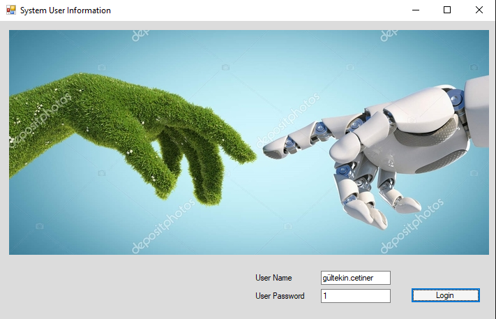
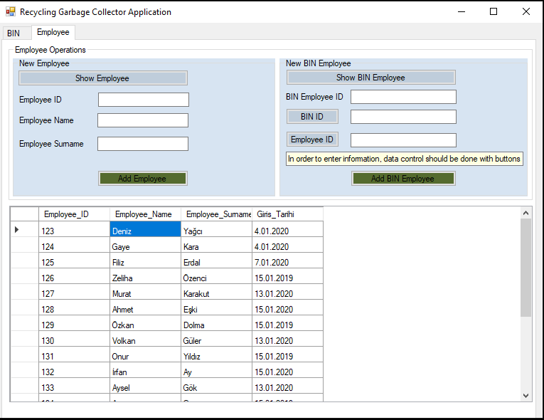
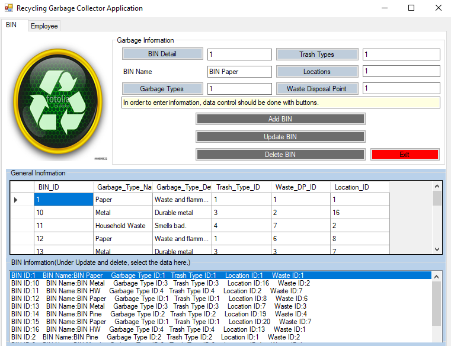

---

## 📦 RGCA\_Project – Recycling Garbage Collector Application

### 🗑️ Overview

The **Recycling Garbage Collector Application (RGCA)** is a Java-based project designed to **optimize the collection and management of recyclable waste** within a university campus. This includes identifying optimal garbage bin placements, tracking recyclable materials (such as plastic, paper, glass, and metal), and managing staff assignments for waste collection and transfer points.

This project not only promotes environmental sustainability but also incorporates elements of optimization and resource efficiency through algorithmic logic.

---

### 🎯 Project Goals

* Minimize the environmental impact of improperly managed waste.
* Optimize the placement of recycling bins and routing of collection operations.
* Reduce collection time and resource usage with efficient employee assignment.
* Raise awareness about the environmental and economic value of recycling.

---

### ♻️ Why Recycling Matters

Recycling is a crucial element in sustainable development. Here's why:

* 🌿 **Conservation of Natural Resources**: Recycling reduces the need for raw materials like wood, water, and minerals.
* ⚡ **Energy Efficiency**: Producing goods from recycled materials often requires significantly less energy.
* 🏞️ **Environmental Protection**: It minimizes landfills and lowers greenhouse gas emissions.
* 💰 **Economic Benefits**: It reduces waste management costs and reliance on imported raw materials.
* 🌍 **Sustainable Future**: Ensures a cleaner, healthier planet for future generations.

**Example Impacts**:

* Recycling 1 ton of paper saves 8 trees.
* Recycled paper production causes:

  * 74–94% less air pollution,
  * 35% less water pollution,
  * 45% less water consumption.

---

### 💡 Features Implemented

* 📍 Location-based bin optimization using predefined criteria.
* 👷 Employee assignment for efficient waste collection and discharge.
* 📦 Material type classification and tracking.
* 🔄 Support for recyclable waste: cardboard, glass, metal, plastic, and paper.

---

### 🛠️ Technologies Used

* **Java** (Core Language)
* **Object-Oriented Programming (OOP)**
* **Algorithm Design** (for optimization logic)
* **File Handling** (for data storage and management)

---

### 📚 Target Audience

This project is developed as part of a **university-level Java course** and is intended for academic evaluation. It demonstrates an integration of environmental awareness with programming and software design skills.

---

### 📌 Conclusion

The RGCA project highlights the importance of integrating software solutions with sustainability goals. By optimizing the waste collection system in educational institutions, it aims to be a model that can be expanded to broader environments such as cities or corporate campuses.

--

## System User Interface

---